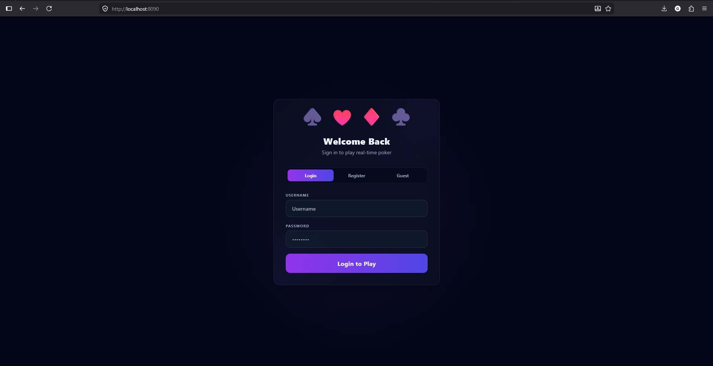
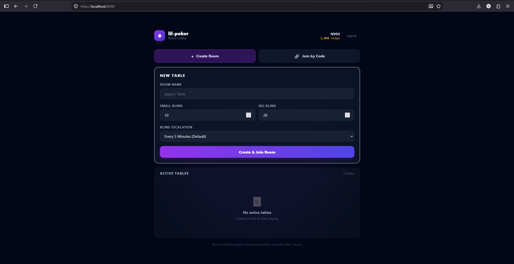
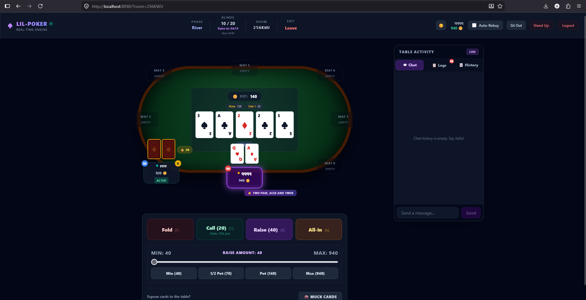
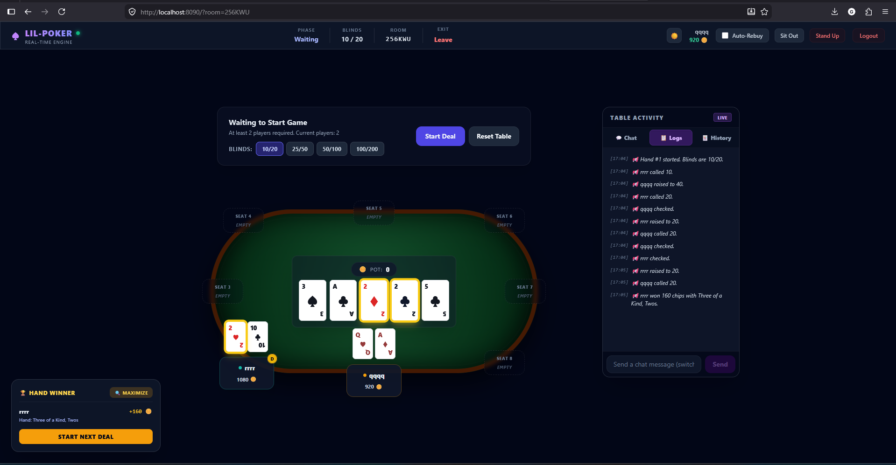

# 🃏 Lil Poker

**Lil Poker** is a web-based multiplayer Texas Hold'em poker game played in real-time. Built with a modern and highly efficient technology stack, it allows players to create custom game rooms with flexible settings, chat, and play poker with friends.

## 📸 Screenshots

<p align="center">
  
  
</p>
<p align="center">
  
  
</p>

---

## 🚀 Key Features

- **Real-Time Gameplay**: Instant game state updates and synchronization powered by **WebSockets**.
- **Room Management (Lobby)**:
  - Create custom game rooms with tailored rules.
  - Adjust small/big blind values and turn timeout durations.
  - Time-based automatic blind escalation.
  - Set initial stack sizes and maximum rebuy limits.
- **Flexible Authentication**:
  - Quick Guest login to start playing instantly without registration.
  - Registered user accounts to persist chip balances and records.
- **Interactive Game Interface**:
  - Responsive 3D-like table layout showing seats, chip stacks, dealer button, board cards, and sub-pots.
  - Action panel with Fold, Check/Call, and Bet/Raise options (featuring an interactive bet slider).
  - Turn countdown timer for active players.
  - Hand history tracking.
  - Optional auto-rebuy toggle.
- **Communication & Logging**: Integrated real-time chat and system logs highlighting active table events.
- **Security & Stability**:
  - Session collision detection (disallows multiple active tabs for the same account).
  - Rate limiting on authentication, room creation, and actions.
  - Strict Origin (CORS/CSRF) checks.

---

## 🛠 Technology Stack

### Backend
- **Programming Language**: Go (Golang) v1.26
- **Database**: PostgreSQL 17 (persisting user profiles and chip balances)
- **Cache**: Redis 8.8 (caching and validating session cookies)
- **Real-time Engine**: Gorilla WebSockets
- **Migrations**: Automated sql-migrations embedded directly in the binary (`go:embed`)

### Frontend
- **Framework/Library**: React (TypeScript)
- **Build Tool**: Vite
- **Styling**: Tailwind CSS
- **Communication**: Native WebSocket API & Fetch API

### Infrastructure & DevOps
- **Containerization**: Docker & Docker Compose
- **Automation**: Makefile

---

## 📂 Project Structure

```text
lil-poker/
├── backend/               # Go backend server and game engine
│   ├── cmd/server/        # Application entrypoint (main.go)
│   └── internal/          # Core business logic packages
│       ├── api/           # HTTP endpoints, routing, WebSocket handlers
│       ├── card/          # Card representations (suits, ranks)
│       ├── deck/          # Deck operations and shuffling
│       ├── game/          # Texas Hold'em game engine state machine
│       ├── hand/          # Hand strength evaluator
│       ├── middleware/    # Rate limiters and utility middlewares
│       ├── room/          # Rooms manager and client broadcaster
│       └── store/         # PostgreSQL persistence and SQL migrations
├── frontend/              # React single-page application (SPA)
│   ├── src/               # React components, hooks, assets, and utilities
│   └── nginx.conf         # Nginx server configuration for Docker deployment
├── docker-compose.yml     # Configuration for Docker services (App, DB, Redis)
└── Makefile               # Helper commands for local development
```

---

## ⚙️ Environment Configuration

To run the project locally, copy the default environment template file:

```bash
cp .env.example .env
```

The `.env` file contains settings for the database, Redis cache, CORS configurations, and secrets:
- `PORT` — Server listener port (defaults to `8080`).
- `DB_HOST`, `DB_PORT`, `DB_USER`, `DB_PASSWORD`, `DB_NAME` — Postgres connection details.
- `REDIS_ADDR` — Redis connection address (defaults to `localhost:6379`).
- `COOKIE_SECRET` — Key used to sign session cookies.
- `ALLOWED_ORIGINS` — Comma-separated list of permitted origins to prevent unauthorized cross-origin requests.

---

## 🚀 Running the Application

All developer utilities are defined inside the Makefile

### Option 1: Run with Docker Compose (Recommended)
This command automatically spins up PostgreSQL, Redis, the Go API, and the React frontend in containerized environments:

```bash
# Build and run the services
make docker-up

# Stop all services
make docker-down

# View container logs
make docker-logs
```

Once running:
- Frontend client will be served at: `http://localhost:8090`
- Backend API server will be listening at: `http://localhost:8080`

### Option 2: Local Development
Ensure Go, Node.js, PostgreSQL, and Redis are installed and running on your host machine.

1. **Install frontend dependencies**:
   ```bash
   make frontend-install
   ```

2. **Start the dev servers (both frontend & backend concurrently)**:
   ```bash
   make dev
   ```
   *Alternatively, you can run them individually:*
   - Start backend: `make dev-backend`
   - Start frontend: `make frontend-dev`

---

## 🧪 Testing & Linting

Verify backend codebase correctness using:

```bash
# Run unit tests
make test

# Run golangci-lint
make lint
```

---

## 📄 License

This project is licensed under the **GNU General Public License v3 (GPL-3.0)**